The PARA Social Research API is the public control plane for LinkedIn and
Reddit research. LinkedIn callers can provide one detailed business use case and
let the server compile the searches and relevance system; legacy topics and
explicit source controls remain available.

The TypeScript core remains the single owner of task scheduling, Chrome-extension execution, PostgreSQL state, matching, reranking, draft generation, immutable result batches, and webhook delivery. FastAPI provides the public versioned contract and owner-scoped API-key authorization.

## Agent entrypoints

Agents should begin with the curated
[`llms.txt`](https://para-linkedin-api.mintlify.site/llms.txt), then read
[Agent quickstart](/agents/quickstart) and [Agent handoff](/agents/handoff).
Machine-readable capabilities and safety rules are available in
[`agent-manifest.json`](/agent-manifest.json). The
[live OpenAPI document](https://para-linkedin-api.onrender.com/openapi.json) is
the canonical request and response contract.

Mintlify also exposes `/llms-full.txt`, `/.well-known/llms.txt`, an installable
[`skill.md`](https://para-linkedin-api.mintlify.app/skill.md), SHA-256-backed
[agent-skill discovery](https://para-linkedin-api.mintlify.app/.well-known/agent-skills/index.json),
an [A2A agent card](https://para-linkedin-api.mintlify.app/.well-known/agent-card.json),
and a Markdown representation of every page by appending `.md`. Human-facing
pages use the `.mintlify.site` domain; generated machine discovery uses
Mintlify's direct `.mintlify.app` origin.

```mermaid
flowchart LR
  A["API client or dashboard"] --> B["FastAPI public control plane"]
  B --> C["Private TypeScript API"]
  C --> P["LinkedIn requirement compiler"]
  P --> D["PostgreSQL task queue"]
  C --> D
  D --> E["Existing paired Chrome extension"]
  E --> F["Expanded platform post storage"]
  F --> G["Initial relevance"]
  G --> H["Platform-specific author context"]
  H --> I["Final rerank and deduplication"]
  I --> J["Comment draft"]
  J --> K["Immutable result batch"]
  K --> L["Signed webhook and polling API"]
```

## Core guarantees

- API keys, registrations, batches, and deliveries are owner scoped.
- Creating an account creates no search work.
- Topics-only legacy registration creation is side-effect free. LinkedIn
  `use_case` creation queues compilation and may auto-activate a validated
  ten-search plan when its HTTPS webhook is valid.
- All LinkedIn and Reddit collection is performed by the paired real Chrome extension in its signed-in profile.
- A result batch is created at most once per registration and local delivery date.
- Polling returns the same stored payload that webhook delivery signs and sends.
- Archived registrations retain historical batches but stop future work.
- Only first-pass LinkedIn matches use Parallel author enrichment. Reddit uses
  only public profile data captured by the extension and never performs identity
  resolution.
- Akhil and Deep's legacy LinkedIn requirements and Reddit configurations remain primary registrations with webhooks disabled.

## Barada setup

Barada Sahu is provisioned with `barada@getmason.io`, a forced-change temporary dashboard password, and a one-time API key. His owner record is granted to the extension runner owned by `akhil@get-para.com`.

Barada can supply one detailed LinkedIn use case; the live compiler produces ten
queries, post and author rubrics, prompts, filters, and weights. LinkedIn
comment drafts and Reddit reply drafts resolve the effective persona to Akhil's
profile and established voice while remaining advisory.

<CardGroup cols={2}>
  <Card title="LinkedIn quickstart" icon="linkedin" href="/quickstart">
    Compile one LinkedIn use case and receive enriched daily post batches.
  </Card>
  <Card title="Reddit quickstart" icon="reddit" href="/reddit/quickstart">
    Register Reddit sources and run collection through the existing real extension.
  </Card>
</CardGroup>
