The PARA LinkedIn Registration API is the public control plane for topic-based LinkedIn research. A user creates one or more independent registrations, and each registration controls its own topics, context, filters, schedule, thresholds, draft settings, and webhook.

The TypeScript core remains the single owner of task scheduling, Chrome-extension execution, PostgreSQL state, matching, Parallel enrichment, reranking, draft generation, immutable result batches, and webhook delivery. FastAPI provides the public versioned contract and owner-scoped API-key authorization.

```mermaid
flowchart LR
  A["API client or dashboard"] --> B["FastAPI public control plane"]
  B --> C["Private TypeScript API"]
  C --> D["PostgreSQL task queue"]
  D --> E["Existing paired Chrome extension"]
  E --> F["Expanded LinkedIn post storage"]
  F --> G["Initial relevance"]
  G --> H["Parallel author enrichment"]
  H --> I["Final rerank and deduplication"]
  I --> J["Comment draft"]
  J --> K["Immutable result batch"]
  K --> L["Signed webhook and polling API"]
```

## Core guarantees

- API keys, registrations, batches, and deliveries are owner scoped.
- Creating an account or draft registration creates no search work.
- Only activation creates the requirement and scheduled extension tasks.
- All LinkedIn collection is performed by the paired Chrome extension in its signed-in profile.
- A result batch is created at most once per registration and local delivery date.
- Polling returns the same stored payload that webhook delivery signs and sends.
- Archived registrations retain historical batches but stop future work.
- Akhil and Deep's legacy requirements remain primary registrations with webhooks disabled.

## Barada setup

Barada Sahu is provisioned with `barada@getmason.io`, a forced-change temporary dashboard password, and a one-time API key. His owner record is granted to the extension runner owned by `akhil@get-para.com`.

Barada supplies his own research topics and relevance context. Draft comments resolve the effective comment persona to Akhil's profile, voice summary, style preferences, and retrieved approved examples. The result payload identifies the effective persona owner without exposing credentials or private prompt responses.

<Card title="Create the first registration" icon="play" href="/quickstart">
  Authenticate, register topics, activate the workflow, and poll its status.
</Card>
