The PARA Social Research API is the public control plane for topic-based LinkedIn and Reddit research. A user creates one or more independent registrations per platform, and each registration controls its own topics, context, filters, sources, schedule, thresholds, draft settings, and webhook.

The TypeScript core remains the single owner of task scheduling, Chrome-extension execution, PostgreSQL state, matching, reranking, draft generation, immutable result batches, and webhook delivery. FastAPI provides the public versioned contract and owner-scoped API-key authorization.

## Agent entrypoints

Agents should begin with the curated
[`llms.txt`](https://para-linkedin-api.mintlify.site/llms.txt), then read
[Agent quickstart](/agents/quickstart) and [Agent handoff](/agents/handoff).
Machine-readable capabilities and safety rules are available in
[`agent-manifest.json`](/agent-manifest.json). The
[live OpenAPI document](https://para-linkedin-api.onrender.com/openapi.json) is
the canonical request and response contract.

The singular `/llm.txt` path redirects to the canonical `/llms.txt` path for
compatibility. Mintlify also exposes `/llms-full.txt`, `/.well-known/llms.txt`,
and a Markdown representation of every page by appending `.md`.

```mermaid
flowchart LR
  A["API client or dashboard"] --> B["FastAPI public control plane"]
  B --> C["Private TypeScript API"]
  C --> D["PostgreSQL task queue"]
  D --> E["Existing paired Chrome extension"]
  E --> F["Expanded platform post storage"]
  F --> G["Initial relevance"]
  G --> H["Platform-specific author context"]
  H --> I["Final rerank and deduplication"]
  I --> J["Comment draft"]
  J --> K["Immutable result batch"]
  K --> L["Signed webhook and polling API"]
```

## Core guarantees

- API keys, registrations, batches, and deliveries are owner scoped.
- Creating an account or draft registration creates no search work.
- Only activation creates the requirement and scheduled extension tasks.
- All LinkedIn and Reddit collection is performed by the paired real Chrome extension in its signed-in profile.
- A result batch is created at most once per registration and local delivery date.
- Polling returns the same stored payload that webhook delivery signs and sends.
- Archived registrations retain historical batches but stop future work.
- LinkedIn uses Parallel author enrichment. Reddit uses only public profile data captured by the extension and never performs identity resolution.
- Akhil and Deep's legacy LinkedIn requirements and Reddit configurations remain primary registrations with webhooks disabled.

## Barada setup

Barada Sahu is provisioned with `barada@getmason.io`, a forced-change temporary dashboard password, and a one-time API key. His owner record is granted to the extension runner owned by `akhil@get-para.com`.

Barada supplies his own research topics and relevance context. LinkedIn comment drafts and Reddit reply drafts resolve the effective persona to Akhil's profile and established voice while remaining advisory. Reddit posting, commenting, and voting stay dashboard-only and require explicit confirmation.

<CardGroup cols={2}>
  <Card title="LinkedIn quickstart" icon="linkedin" href="/quickstart">
    Register LinkedIn topics and receive enriched daily post batches.
  </Card>
  <Card title="Reddit quickstart" icon="reddit" href="/reddit/quickstart">
    Register Reddit sources and run collection through the existing real extension.
  </Card>
</CardGroup>
